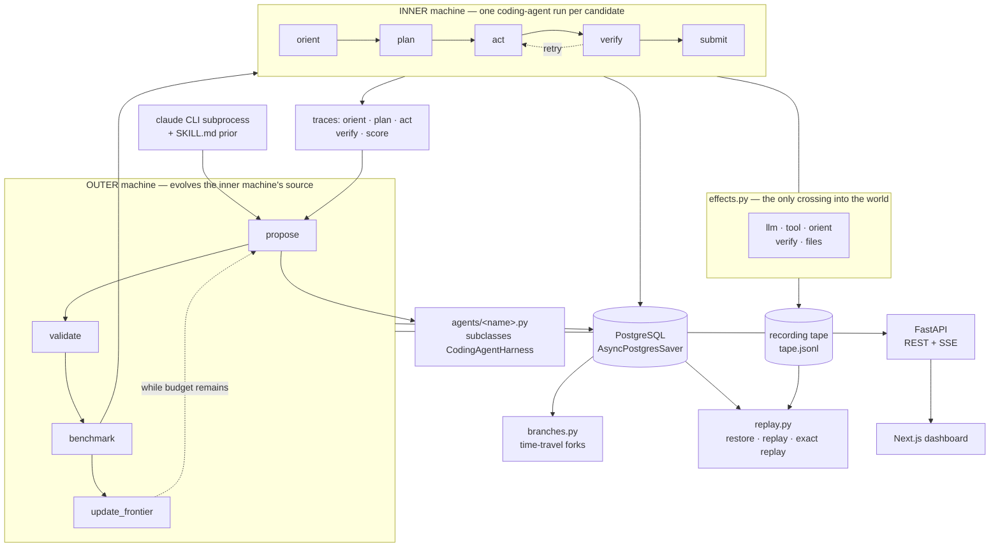

# Meta-Harness

**A LangGraph-native substrate for self-improving coding-agent harnesses,
where the optimisation history is a durable, branchable, exactly-replayable
object rather than a log file.**

An outer agent reads the raw execution traces of an inner coding agent and
rewrites that agent's *source code*. That is the Meta-Harness paradigm
([Lee et al., project page](https://yoonholee.com/meta-harness/)). What
this repository adds is the substrate underneath it: both loops are
LangGraph state machines checkpointed into PostgreSQL, so the search is a
tree you can rewind, fork and re-execute, not a sequence you can only read
about afterwards.

---

## What it does

The paper's loop is **linear**: iteration 1 → 2 → 3 → 4, each proposal
conditioned on the last. Real harness optimisation is not linear. You want
to rewind to iteration 2, give the proposer a different prior, and run
both continuations side by side.

Mapping both loops onto LangGraph state machines makes four properties
fall out of the substrate rather than out of bespoke plumbing:

| Property | Mechanism |
|---|---|
| **Isolated** | Each trial runs in a fresh temp workspace; every artifact a branch writes is scoped to its LangGraph thread, so two concurrent branches cannot overwrite each other |
| **Recoverable** | Every state transition is checkpointed via `AsyncPostgresSaver`; any checkpoint restores to byte-identical state, provable by SHA-256 |
| **Reversible** | Time travel via `get_state_history` + `update_state` + `ainvoke(None, ckpt_id)`, with branch metadata persisted to disk so it survives a restart |
| **Replayable** | A recorded run re-executes from any of its stored checkpoints against its tape: same transitions, same final state byte-for-byte, zero model calls |

Around that core: a Pareto frontier over accuracy × measured tokens,
cross-run memory that carries patterns from one run into the next, a
two-arm benchmark protocol with search/holdout isolation and cluster-aware
statistics, optional Weights & Biases tracking, a FastAPI backend that
streams events over SSE, and a Next.js dashboard that renders the search
tree live.

---

## Architecture

Two nested state machines. The outer one evolves the inner one's source
code; the inner one is a coding agent that runs per candidate.



**Outer machine** (`backend/app/meta_harness/outer.py`) — `propose →
validate → benchmark → update_frontier`, looping while budget remains.
`propose` spawns a `claude` CLI subprocess that reads the branch's own
traces, evolution log and Pareto frontier, then writes a new
`agents/<name>.py`.

**Inner machine** (`backend/app/meta_harness/inner.py`) — `orient → plan →
act → verify → submit`, with a conditional edge from `verify` back to
`act`.

**A fixed contract and an evolvable shape.** The six tools in `tools.py`
(`read_file`, `apply_patch`, `write_file`, `run_bash`, `grep_search`,
`task_complete`) are the contract with the evaluator and cannot be
modified by candidates. The search space is the **11 override points** on
`CodingAgentHarness` — turn budget, retry policy, system prompt, plan
template, tool-result formatting, the `verify → act` loop-back predicate,
and so on. A candidate subclasses `CodingAgentHarness` and overrides a
subset.

**Everything that touches the world goes through `effects.py`.** Model
calls, tool dispatch, the workspace scan, the verify subprocess, the
final-file snapshot and every trace write. That single boundary is what
makes recording and exact replay possible.

### Recorded replay

When a run is started with `--record`, every crossing of the `effects.py`
boundary is appended to a tape. Replaying that run re-executes the real
graph, the real nodes and the real tools, but each effect is served from
the tape instead of the world. The replay fails loudly unless all five
hold: `no_divergence` · `node_sequence_identical` ·
`per_step_state_hashes_identical` · `final_state_byte_identical` ·
`tape_fully_consumed`.

Four operations are called "replay"; only one earns the unqualified phrase
*exact replay*:

| Command | Executes? | Model calls | Guarantee |
|---|---|---|---|
| `replay <run>` | no | none | the recorded transitions, in order |
| `replay <run> --checkpoint <id>` | no | none | that checkpoint's exact state, provable by SHA-256 |
| `replay <run> --checkpoint <id> --verify` | **yes** | **none** | same nodes, same per-step state hashes, same final state byte-for-byte |
| `resume <run>` | yes | **fresh** | a new stochastic execution from an old state — *not* reproducible |

---

## Tech stack

| Component | Choice |
|---|---|
| State machines | LangGraph 0.2+ |
| Checkpointer | `AsyncPostgresSaver` (langgraph-checkpoint-postgres) |
| Database | PostgreSQL 16 |
| Containers | Docker + Compose — multi-stage, non-root, healthchecked backend image beside Postgres |
| Backend API | FastAPI 0.115+ + Uvicorn, with Pydantic 2 request models and an SSE event stream |
| Inner-loop LLM | Claude Haiku 4.5 by default; override with `META_HARNESS_INNER_MODEL` |
| Proposer | Claude Code CLI subprocess, primed with `SKILL.md` via `--append-system-prompt` |
| Experiment tracking | Weights & Biases, optional — disabled, offline and online modes |
| CLI | Typer + python-dotenv |
| Frontend | Next.js 16, Tailwind 4, ReactFlow, D3, Monaco |
| Workspace tooling | uv (workspace mode: `sdk/` + `backend/`) |
| Testing | pytest, pytest-asyncio, Playwright |

---

## Run it locally

**Prerequisites** — Python 3.11+ and [uv](https://github.com/astral-sh/uv);
Docker (for Postgres); Node.js 20+ for the dashboard. For live model runs:
an `ANTHROPIC_API_KEY` and the
[Claude Code CLI](https://docs.anthropic.com/en/docs/claude-code/overview)
(`claude`) for the real proposer.

```bash
git clone https://github.com/davidyang07/Meta-Harness.git
cd Meta-Harness
cp .env.example .env                                        # Include API Keys
uv sync
docker compose -f infra/docker-compose.yml up -d postgres

make verify                                                 # everything provable without credentials
```

### Deterministic demo — no API key, no cost

Mock proposer, mock benchmark. Every synthetic score is labelled
`metrics_source: "mock"` in artifacts, the API and the dashboard status bar.

```bash
uv run meta-harness loop --proposer mock --mock-bench --budget 2 --fresh

uv run meta-harness serve --port 8000                       # terminal 1
cd frontend/dashboard && npm install && npm run dev         # terminal 2
```

> Start the backend with `meta-harness serve`, never a bare
> `uvicorn app.main:app`. uvicorn selects Windows' `ProactorEventLoop`,
> which psycopg cannot use. `GET /health` reports `persistence` and
> `persistence_error` so a degraded backend is never silent.

### Live model demo — needs credentials, small cost

```bash
uv run meta-harness inner --task task-001-fix-typo --candidate baseline
uv run meta-harness loop --proposer claude --budget 1 --fresh --mock-bench
```

### The whole stack in Docker

```bash
docker compose -f infra/docker-compose.yml up -d --build    # postgres + backend
curl localhost:8000/health
docker compose -f infra/docker-compose.yml down             # stop (add -v to wipe data)
```

### Other commands worth knowing

```bash
uv run meta-harness checkpoints <run-name>
uv run meta-harness fork <run-name> --checkpoint <id> --mod proposer_prior="try X"
uv run meta-harness resume <run-name>            # FRESH model calls; not a replay

uv run meta-harness inner --task task-001-fix-typo --candidate baseline --record
uv run meta-harness replay <run-name> --checkpoint <id> --verify
uv run meta-harness verify-replay runs/<run-name>

uv run meta-harness benchmark --candidate <name> --trials 5
uv run meta-harness canonical-experiment --dry-run   
uv run meta-harness canonical-experiment             

uv run meta-harness report capability-evidence
uv run meta-harness report version-graph <run-name>
uv run meta-harness memory list                      # cross-run patterns

uv sync --extra wandb                                # optional tracking, off by default
WANDB_MODE=offline uv run meta-harness loop --wandb --proposer mock --mock-bench --budget 2
```

### Tests

```bash
make verify                                # the full credential-free ladder
make verify-fast                           # skips the Docker and dashboard builds
ONLY=postgres bash scripts/verify.sh       # one stage

cd backend && uv run pytest tests/ -q      # the suite alone
```

`make verify` runs the backend suite, the Postgres-backed suites, replay,
branching, benchmark protocol validity, W&B offline, capability evidence,
the Docker image, repository hygiene and the dashboard build. CI runs the
same ladder on every push with `ANTHROPIC_API_KEY` deliberately empty,
plus Playwright end-to-end projects against fixtures and a live backend.

---

## Evaluation

The canonical protocol is committed at
[`benchmarks/pass-rate/`](benchmarks/pass-rate/): 5 frozen search tasks ×
20 independent trials × 2 arms. A separate generalisation protocol
([`benchmarks/holdout/`](benchmarks/holdout/)) runs 2 unseen tasks × 20
trials × 2 arms. Candidate selection uses only the validation accuracy
measured *during* evolution; the canonical experiment then runs afterwards
with fresh independent trials.

Every reported field is derived from the raw `*-results.jsonl` rows by
`experiment.summarize()` — pass rates with pass and trial counts, the
absolute percentage-point delta, per-task outcomes, a task-cluster
bootstrap 95% interval under a deterministic seed, and tokens, cost and
wall time. The guards are tests, not conventions: no target can reach the
computation, mock rows cannot become results, held-out tasks cannot
influence selection, both arms must have run one protocol, and CI
re-derives every published summary from its committed rows.

---

## Repository layout

```
meta-harness/
├── backend/app/
│   ├── cli.py · main.py · api/                # CLI, FastAPI app, REST + SSE routers
│   └── meta_harness/
│       ├── outer.py · inner.py · state.py     # the two state machines + schemas
│       ├── harness.py · tools.py              # 11 override points, 6 fixed tools
│       ├── proposer.py · candidates.py        # claude CLI proposer, per-branch snapshots
│       ├── benchmark.py · metrics.py          # measured trial core, tokens + cost
│       ├── experiment.py · pipeline.py        # two-arm protocols, evolve → measure → report
│       ├── effects.py · recording.py · replay.py
│       ├── branches.py · versioning.py · persistence.py · runs.py
│       └── frontier.py · memory.py · tracking.py · evidence.py · sandbox.py
├── frontend/dashboard/                        # Next.js 16 dashboard (+ e2e/)
├── benchmarks/                                # committed protocols + published results
├── eval/tasks/ · eval/holdout/                # 5 frozen search tasks, 2 unseen tasks
├── agents/baseline.py                         # the immutable starting harness
├── sdk/meta_harness/                          # public Python library
├── skills/meta-harness-coding-agent/SKILL.md  # the proposer's injected workflow
└── scripts/ · infra/ · docs/                  # verify ladder, Docker, contracts
```

Execution state is thread-scoped, which is what makes concurrent branches
safe:

```
runs/<run_id>/
├── manifest.json                      # run config + metrics_source
├── branches.json                      # durable branch metadata (survives restart)
└── threads/<thread_id>/
    ├── pending_eval.json              # this branch's propose → benchmark handoff
    ├── frontier_val.json              # this branch's Pareto frontier
    ├── evolution_summary.jsonl        # this branch's candidates
    ├── agents/<candidate>.py          # what this branch actually benchmarked
    ├── candidates/<candidate>/        # eval-result.json, status.json, traces/
    └── proposer-sessions/iter-N/      # transcript, events, session.json
```

---

## Security posture

Sandboxing is **process isolation only**: a fresh temp-directory workspace
per trial, a wall-clock timeout, and — on Unix — `RLIMIT_CPU` /
`RLIMIT_AS`. There is no container, network restriction or binary
allowlist. Eval `test_command`s run with `shell=True` as trusted
repository content, and the proposer runs with
`--dangerously-skip-permissions` in the repository working directory —
treat a run as "this repo executes model-written code". Path inputs
arriving over HTTP are pattern-checked and containment-checked before
being joined to a path.

---

## Documentation

| Doc | When to read |
|---|---|
| [`docs/INTERFACES.md`](docs/INTERFACES.md) | **Always** — every cross-boundary contract. Start at §0 Amendments |
| [`docs/CAPABILITIES.md`](docs/CAPABILITIES.md) | Capability → code → the command that validates it |
| [`docs/CAPABILITY_EVIDENCE.md`](docs/CAPABILITY_EVIDENCE.md) | Generated — the current state of every claim |
| [`benchmarks/pass-rate/README.md`](benchmarks/pass-rate/README.md) | Before running or citing a benchmark |
| [`ARCHITECTURE_SECTION_1.md`](ARCHITECTURE_SECTION_1.md) · [`docs/PROJECT_LAYOUT.md`](docs/PROJECT_LAYOUT.md) | Orientation |
| [`skills/meta-harness-coding-agent/SKILL.md`](skills/meta-harness-coding-agent/SKILL.md) | What the proposer actually reads |

**`docs/INTERFACES.md` is the contract.** Any change touching a state
schema, JSON shape, REST endpoint, SSE event, tool I/O or override point
updates that document in the same change.

---

## Acknowledgments

- Yoonho Lee, Roshen Nair, Qizheng Zhang, Kangwook Lee, Omar Khattab and
  Chelsea Finn — *Meta-Harness: End-to-End Optimization of Model
  Harnesses*, [project page](https://yoonholee.com/meta-harness/), and
  the reference framework at
  [stanford-iris-lab/meta-harness](https://github.com/stanford-iris-lab/meta-harness).
- The LangChain team, for LangGraph's time-travel primitives — they make
  the linear-to-tree mapping possible without a bespoke orchestration
  layer.
- Anthropic, for the Claude Code CLI's `--append-system-prompt` and
  stream-json output, which let the filesystem-mediated proposer pattern
  be reproduced directly.

## License

MIT — see [LICENSE](LICENSE).
