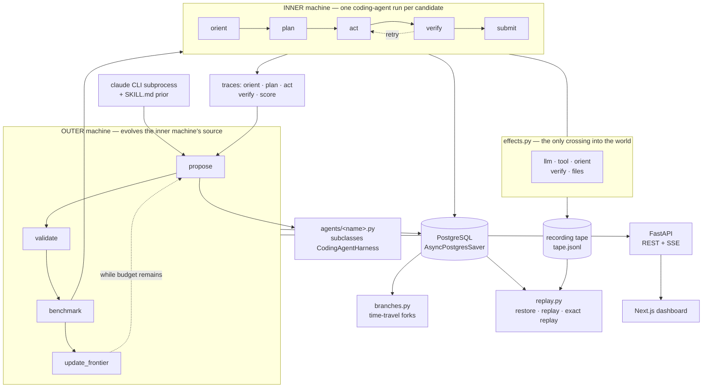

# Meta-Harness

**A LangGraph-native substrate for self-improving coding-agent harnesses,
where the optimisation history is a durable, branchable, exactly-replayable
object rather than a log file.**

An outer agent reads the raw execution traces of an inner coding agent and
rewrites that agent's *source code*. That is the Meta-Harness paradigm
([Lee et al., project page](https://yoonholee.com/meta-harness/)). What
this repository adds is the substrate underneath it: both loops are
LangGraph state machines checkpointed into PostgreSQL, so the search is a
tree you can rewind, fork and re-execute, not a sequence you can only read
about afterwards.

> **On numbers.** No pass-rate measurement has been run in this
> repository — that needs provider credentials and real spend. The
> measurement pipeline is implemented, tested and documented; the
> measurement itself is `UNSUPPORTED` in
> [`docs/CAPABILITY_EVIDENCE.md`](docs/CAPABILITY_EVIDENCE.md), and no
> number is claimed anywhere. See
> [Implemented, dependent, measured](#implemented-dependent-measured) for
> why that distinction is kept sharp.

---

## Contents

1. [What it does](#1-what-it-does)
2. [Architecture](#2-architecture)
3. [Core capabilities](#3-core-capabilities)
4. [Recorded replay](#4-recorded-replay)
5. [Evaluation architecture](#5-evaluation-architecture)
6. [Quick start](#6-quick-start)
7. [Testing and CI](#7-testing-and-ci)
8. [Tech stack](#8-tech-stack)

Plus: [security posture](#security-posture),
[repository layout](#repository-layout), [documentation](#documentation).

---

## 1. What it does

The paper's loop is **linear**: iteration 1 → 2 → 3 → 4, each proposal
conditioned on the last. Real harness optimisation is not linear. You want
to rewind to iteration 2, give the proposer a different prior, and run
both continuations side by side.

Mapping both loops onto LangGraph state machines makes four properties
fall out of the substrate rather than out of bespoke plumbing:

| Property | Mechanism | What it does **not** mean |
|---|---|---|
| **Isolated** | Each trial runs in a fresh temp workspace; every artifact a branch writes is scoped to its LangGraph thread, so two branches cannot overwrite each other | Not container or network isolation — see [Security posture](#security-posture) |
| **Recoverable** | Every state transition is checkpointed via `AsyncPostgresSaver`; any checkpoint restores to byte-identical state, provable by SHA-256 | Not that *re-running* from a checkpoint reproduces the same model output. That is `resume`, and it is a fresh stochastic execution |
| **Reversible** | Time travel via `get_state_history` + `update_state` + `ainvoke(None, ckpt_id)`, with branch metadata persisted to disk so it survives a restart | Not that a running branch's asyncio task survives a restart — it does not, and it reports as `interrupted` |
| **Replayable** | A **recorded** run re-executes from any of its stored checkpoints against its tape: same transitions, same final state byte-for-byte, zero model calls | Not that an *unrecorded* run can be replayed exactly. Recording is opt-in (`--record`) |

The substrate is the contribution. Every property above maps to a test
and to a row in [`docs/CAPABILITIES.md`](docs/CAPABILITIES.md).

---

## 2. Architecture

Two nested state machines. The outer one evolves the inner one's source
code; the inner one is a coding agent that runs per candidate.



**Outer machine** (`backend/app/meta_harness/outer.py`) — `propose →
validate → benchmark → update_frontier`, looping while budget remains.
`propose` spawns a `claude` CLI subprocess that reads the branch's own
traces, evolution log and Pareto frontier, then writes a new
`agents/<name>.py`.

**Inner machine** (`backend/app/meta_harness/inner.py`) — `orient → plan →
act → verify → submit`, with a conditional edge from `verify` back to
`act`.

**The contract and the search space.** The six tools in `tools.py`
(`read_file`, `apply_patch`, `write_file`, `run_bash`, `grep_search`,
`task_complete`) are the contract with the evaluator and cannot be
modified by candidates. The search space is the **11 override points** on
`CodingAgentHarness` — turn budget, retry policy, system prompt, plan
template, tool-result formatting, the `verify → act` loop-back predicate,
and so on. A candidate subclasses `CodingAgentHarness` and overrides a
subset.

**Everything that touches the world goes through `effects.py`.** Model
calls, tool dispatch, the workspace scan, the verify subprocess, the
final-file snapshot and every trace write. That single boundary is what
makes recording and exact replay possible; a nondeterministic call added
to a node body that skips it silently breaks replay.

---

## 3. Core capabilities

| Capability | Where it lives | How you check it |
|---|---|---|
| Trace-driven self-improvement | `inner.py`, `proposer.py`, `runs.py` | Proposals are conditioned on recorded traces, not a scalar score |
| Two separate LangGraph machines | `outer.py`, `inner.py` | Both graphs compiled, node sets read back and shown disjoint |
| propose → validate → benchmark → frontier | `outer.py`, `frontier.py` | `make verify`; Pareto on accuracy × measured tokens |
| PostgreSQL checkpointing | `persistence.py` | `meta-harness checkpoints <run>`; `ONLY=postgres bash scripts/verify.sh` |
| Immutable branching / version restore | `branches.py`, `versioning.py` | `meta-harness fork`; `report version-graph` |
| Exact recorded-execution replay | `effects.py`, `recording.py`, `replay.py` | `meta-harness verify-replay <dir>` — zero provider calls |
| Canonical 200-trial protocol | `experiment.py`, `benchmarks/pass-rate/` | `meta-harness canonical-experiment --dry-run` |
| Search / holdout isolation | `experiment.check_task_set_isolation` | Refuses to run on overlap |
| Raw-result provenance + publication gates | `experiment.py` | CI re-derives every published summary from its rows |
| Cluster-aware statistics | `experiment.cluster_bootstrap_diff_ci` | Deterministic seed, published with the interval |
| Token / cost instrumentation | `metrics.py` | Unmeasured is `null`, never `0` |
| Optional W&B tracking | `tracking.py` | Disabled, offline and online; `report wandb-check` |
| FastAPI + Pydantic | `main.py`, `api/` | `meta-harness serve`, then `GET /health` |
| Dockerised backend + Postgres | `infra/` | `bash scripts/docker_smoke.sh` |
| Automated evidence generation | `evidence.py` | `report capability-evidence --check` |

### Implemented, dependent, measured

Three different things, and the repository never blends them:

- **Implemented capability** — code exists, is exercised by tests, and
  can be run right now with no credentials. Almost everything above.
- **External runtime dependency** — the capability is complete but a
  particular *run* needs something this environment does not have: an
  `ANTHROPIC_API_KEY`, the `claude` CLI, a Docker daemon. A missing
  credential is a missing input, not unfinished architecture.
- **Measured empirical result** — a number produced by running the
  canonical protocol against a real model. There are none in this
  repository, and the evidence document says so rather than softening it.

---

## 4. Recorded replay

**Exact replay means deterministic re-execution against recorded effects.
It does not mean deterministic fresh inference** — fresh model calls stay
stochastic, and nothing here claims otherwise.

When a run is started with `--record`, every crossing of the `effects.py`
boundary is appended to a tape (`recording.py`). Replaying that run
re-executes the real graph, the real nodes and the real tools, but each
effect is served from the tape instead of the world. The replay fails
loudly unless all five hold:

`no_divergence` · `node_sequence_identical` ·
`per_step_state_hashes_identical` · `final_state_byte_identical` ·
`tape_fully_consumed`

Byte-identical final state is only achievable because `act` stamps
positional message ids and clears before writing — LangGraph's
`add_messages` mints a random UUID for any message that arrives without
one, which would otherwise make every execution differ.

### Four things called "replay"

Only one of them earns the unqualified phrase *exact replay*.

| Command | Executes? | Model calls | Guarantee |
|---|---|---|---|
| `replay <run>` | no | none | the recorded transitions, in order |
| `replay <run> --checkpoint <id>` | no | none | that checkpoint's exact state, provable by SHA-256 |
| `replay <run> --checkpoint <id> --verify` | **yes** | **none** | same nodes, same per-step state hashes, same final state byte-for-byte, tape consumed exactly |
| `resume <run>` | yes | **fresh** | a new stochastic execution from an old state — *not* reproducible |

```bash
uv run meta-harness inner --task task-001-fix-typo --candidate baseline --record
uv run meta-harness replay <run-name> --checkpoint <id> --verify
uv run meta-harness verify-replay runs/<run-name>
```

---

## 5. Evaluation architecture

The canonical protocol is committed at
[`benchmarks/pass-rate/config.json`](benchmarks/pass-rate/):

```
5 frozen search tasks × 20 independent trials × 2 arms = 200 comparison trials
```

Plus a separate generalisation protocol on tasks the proposer never saw
([`benchmarks/holdout/`](benchmarks/holdout/)): 2 tasks × 20 trials × 2
arms = 80 trials. **Search trials and validation trials are kept apart**:
candidate selection uses only the validation accuracy measured *during*
evolution, and the canonical experiment then runs afterwards with fresh
independent trials.

### What a result reports

Every field is derived from the raw `*-results.jsonl` rows by
`experiment.summarize()`, which takes rows and labels and nothing else:

- baseline and candidate pass rates, with pass and trial counts
- the absolute percentage-point delta
- per-task outcomes
- a **task-cluster bootstrap 95% interval** under a deterministic seed —
  tasks are the independent unit, and every trial of a drawn task travels
  with it
- tokens, cost and wall time, with `null` wherever a value was not measured

The Wald interval is also reported, always alongside the statement that
it assumes 200 independent Bernoulli trials that this design does not
have. With five task clusters the bootstrap interval carries its own
stated limitation rather than being quoted as a general estimate.

### The guards

Each of these is a test, not a convention:

| Guard | Enforced by |
|---|---|
| No target can reach the computation | `summarize()` takes no target parameter — asserted by signature inspection; no threshold constant may exist in `evidence.py`; no evidence row may grade a number against a bar |
| No task declares an expected outcome | Task specs carry no `baseline_pass_rate`. Earlier revisions did, unread by any code — a target inside the measuring instrument |
| Mock rows cannot become results | Every row carries `metrics_source`. A `"mock"` row is rejected by `check_protocol_equality` and raises in the bootstrap |
| Held-out tasks cannot influence selection | `check_task_set_isolation` — the experiment refuses to start on overlap |
| Both arms ran one protocol | `check_protocol_equality` compares tasks, trial counts, per-task counts and model; the verdict is published as `validation.json` |
| Summaries reproduce from raw rows | CI recomputes every published summary from its committed rows and fails on any disagreement |
| Incomplete arms are detected | `trial_completeness` names missing, duplicated and malformed trials. A row with no outcome is *unknown*, not a failure |

```bash
uv run meta-harness canonical-experiment --dry-run   # plan + cost estimate, spends nothing
uv run meta-harness canonical-experiment             # THIS COSTS MONEY
```

---

## 6. Quick start

**Prerequisites** — Python 3.11+ and [uv](https://github.com/astral-sh/uv);
Docker (for Postgres); Node.js 20+ for the dashboard. For live model runs
only: an `ANTHROPIC_API_KEY` and the
[Claude Code CLI](https://docs.anthropic.com/en/docs/claude-code/overview)
(`claude`) for the real proposer.

```bash
git clone https://github.com/davidyang07/Meta-Harness.git
cd Meta-Harness
cp .env.example .env                                        # API key optional
uv sync
docker compose -f infra/docker-compose.yml up -d postgres

make verify                                                 # see §7
```

### Run the whole stack in Docker

```bash
docker compose -f infra/docker-compose.yml up -d --build    # postgres + backend
curl localhost:8000/health
# {"status":"ok","persistence":"postgres","persistence_error":null,...}

docker compose -f infra/docker-compose.yml down             # stop
docker compose -f infra/docker-compose.yml down -v          # stop and wipe data
```

Properties `scripts/docker_smoke.sh` and CI both enforce:

- **Reproducible dependencies** — the image installs from `uv.lock` with
  `uv sync --frozen`, so a drifted lockfile fails the build.
- **Non-root** — the process runs as uid 10001.
- **No credentials in the image** — `POSTGRES_DSN`, `ANTHROPIC_API_KEY`
  and the `META_HARNESS_*` knobs are read from the environment at run
  time; `.env` is excluded from the build context entirely.
- **An honest healthcheck** — the container reports *unhealthy* when the
  API is up but Postgres is not. A backend in that state still answers
  requests with checkpointing silently degraded to in-memory: no
  checkpoint history, no forking, no branch recovery. Set
  `META_HARNESS_HEALTHCHECK_REQUIRE_POSTGRES=0` to run without a
  database deliberately.

### Deterministic demo — no API key, no cost

Mock proposer, mock benchmark. Every synthetic score is labelled
`metrics_source: "mock"` in artifacts, the API and the dashboard status
bar, and cannot reach a published result.

```bash
uv run meta-harness loop --proposer mock --mock-bench --budget 2 --fresh

uv run meta-harness serve --port 8000                       # terminal 1
cd frontend/dashboard && npm install && npm run dev         # terminal 2

bash scripts/demo_acceptance.sh                             # full offline ladder
```

> Start the backend with `meta-harness serve`, never a bare
> `uvicorn app.main:app`. uvicorn selects Windows' `ProactorEventLoop`,
> which psycopg cannot use, and the server would come up with
> checkpointing degraded to in-memory. `/health` reports `persistence`
> and `persistence_error` so a degraded backend is never silent.

### Live model demo — needs credentials, small cost

```bash
uv run meta-harness inner --task task-001-fix-typo --candidate baseline
uv run meta-harness loop --proposer claude --budget 1 --fresh --mock-bench
bash scripts/live_smoke.sh        # prints SKIPPED without credentials
```

### Other commands worth knowing

```bash
uv run meta-harness resume <run-name>          # FRESH model calls; not a replay
uv run meta-harness checkpoints <run-name>
uv run meta-harness fork <run-name> --checkpoint <id> --mod proposer_prior="try X"
uv run meta-harness benchmark --candidate <name> --holdout

uv run meta-harness report capability-evidence  # regenerate the evidence document
uv run meta-harness report version-graph <run-name>
uv run meta-harness report cost-estimate
uv run meta-harness report wandb-check

uv sync --extra wandb                          # optional tracking, off by default
WANDB_MODE=offline uv run meta-harness loop --wandb --proposer mock --mock-bench --budget 2

uv run meta-harness memory list                # cross-run patterns
```

---

## 7. Testing and CI

**One command proves everything provable without paid model calls:**

```bash
make verify          # or: bash scripts/verify.sh   (no `make` needed)
make verify-fast     # skips the Docker image build and the dashboard build
```

It runs, and fails loudly on, each of:

| Stage | What it settles |
|---|---|
| `tests` | The whole backend suite |
| `postgres` | Postgres is reachable **and** the Postgres-backed suites actually ran — a suite that skipped itself fails the stage rather than passing quietly |
| `replay` | Recording, message identity, exact recorded-execution replay |
| `branches` | Forking, branch isolation, branch recovery, the version graph, thread-scoped artifacts |
| `benchmark` | Protocol validity, holdout isolation, metrics, frontier, and re-derivation of every published summary from its raw rows |
| `wandb` | The adapter offline, and degrading cleanly when `wandb` is absent |
| `evidence` | `docs/CAPABILITY_EVIDENCE.md` agrees with its artifacts, and no claim is `FAIL` |
| `docker` | The image builds and the container is a working, non-root, Postgres-connected backend |
| `hygiene` | No `.env`, no keys, no tapes, no caches, no generated artifacts tracked |
| `frontend` | The dashboard lints and builds |

Individual stages: `ONLY=postgres bash scripts/verify.sh`.

**CI proves the architecture without credentials.** `ANTHROPIC_API_KEY` is
deliberately empty in every job. Seven jobs run on each push:
`pytest` (against a real Postgres service, with an explicit gate that
fails the build if the persistence suites skipped), `offline-integrity`
(replay, recording, tracking and evidence with no database, no network
and no W&B), `wandb-offline`, `capability-evidence`, `benchmark-schema`,
`docker`, and `hygiene`. Plus separate `frontend` and `e2e` workflows —
Playwright runs a `mock` project with no backend and a `live-backend`
project against a real API with a deterministic mock proposer.

```bash
cd backend && uv run pytest tests/ -q                    # the suite alone
cd backend && uv run pytest tests/test_inner.py -q       # one file
```

`pytest-asyncio` runs in `asyncio_mode = "auto"`; async tests need no
decorator. The single live-model test skips itself without
`ANTHROPIC_API_KEY`.

---

## 8. Tech stack

| Component | Choice |
|---|---|
| State machines | LangGraph 0.2+ |
| Checkpointer | `AsyncPostgresSaver` (langgraph-checkpoint-postgres) |
| Database | PostgreSQL 16 |
| Containers | Docker + Compose — backend image (multi-stage, non-root, healthchecked) beside Postgres, built and smoke-tested in CI |
| Backend API | FastAPI 0.115+ + Uvicorn, Pydantic 2 models on every request and response |
| Inner-loop LLM | Claude Haiku 4.5 by default — cheap and rate-limit-friendly; override with `META_HARNESS_INNER_MODEL` |
| Proposer | Claude Code CLI subprocess (subscription auth), primed with `SKILL.md` via `--append-system-prompt` |
| Experiment tracking | Weights & Biases, optional — disabled, offline and online modes; `tracking.py` is the only module allowed to import it |
| CLI | Typer + python-dotenv |
| Frontend | Next.js 16, Tailwind 4, ReactFlow, D3, Monaco |
| Workspace tooling | uv (workspace mode: `sdk/` + `backend/`) |
| Testing | pytest, pytest-asyncio, Playwright |

---

## Security posture

Stated plainly, because the honest version is short:

- **Sandboxing is process isolation only.** Each trial gets a fresh
  temp-directory workspace, a wall-clock timeout, and — on Unix —
  `RLIMIT_CPU` / `RLIMIT_AS`. There is **no container, no network
  restriction and no binary allowlist**. On Windows the rlimits do not
  apply at all.
- **Eval task commands are trusted repository content.** `test_command`
  from `eval/tasks/*/task.json` runs with `shell=True`. That is a
  deliberate trust boundary: task definitions are committed source, not
  user input.
- **The proposer runs with `--dangerously-skip-permissions`** in the
  repository working directory. Treat a run as "this repo executes
  model-written code", because it does.
- **Path inputs are validated.** Run ids, candidate names, branch names
  and thread ids arriving over HTTP are checked against a strict name
  pattern and containment-checked before being joined to a path.

Do not run this against untrusted task definitions, or on a host you care
about, without adding real isolation.

---

## What's distinctive about this implementation

1. **Two LangGraph state machines, not one.** The outer machine evolves
   the inner machine's source code. Both are checkpointed via
   `AsyncPostgresSaver` — the outer loop threads its saver down into
   every inner trial — and the outer graph supports time-travel forking.
2. **The "meta-harness tool" is a SKILL.md, not a framework feature.**
   ~150 lines of Markdown injected via `--append-system-prompt` when the
   proposer subprocess is spawned. The anti-overfitting and
   anti-parameter-tuning rules there are load-bearing, not decoration.
3. **A fixed contract and an evolvable shape.** Six tools are the
   contract; eleven override points are the search space.
4. **`apply_patch` returns `context_echo` on mismatch.** When a unified
   diff fails to apply, the tool surfaces the file's actual current
   content at the failed range, so the model repairs the patch without
   re-reading the file.
5. **Forks are concurrent and genuinely isolated.** `asyncio.create_task`
   over `graph.ainvoke` shares one `AsyncPostgresSaver`, so both branches
   grow at once. What makes that a real search tree: every artifact a
   branch writes is scoped to its LangGraph thread
   (`runs/<run>/threads/<thread_id>/`), and each branch snapshots its own
   candidate source. Two branches at the same iteration cannot overwrite
   each other's pending evaluation, frontier, evolution log, proposer
   session or traces.
6. **The baseline is measured, not assumed.** Every run benchmarks
   `agents/baseline.py` under the identical protocol before the first
   propose, so iteration 1's delta compares against a measurement rather
   than against zero.
7. **Unknown is not zero.** A model with no configured price yields
   `cost_usd: null`, not `$0.00`; an unmeasured candidate cannot dominate
   a measured one on the Pareto cost axis; mock results refuse to
   aggregate with measured ones.
8. **Selection is upstream of measurement.** `pipeline.select_candidate`
   takes the outer loop's terminal state and nothing else, so the final
   experiment's trials cannot influence which candidate they measure.
9. **Cross-run memory.** A pattern learned in run A flows into run B's
   proposer prompt, so a new run does not start cold.

---

## Repository layout

```
meta-harness/
├── Makefile                                   # `make verify` and friends
├── backend/
│   ├── app/
│   │   ├── cli.py                             # `meta-harness` CLI (typer)
│   │   ├── main.py                            # FastAPI app factory
│   │   ├── event_loop.py                      # psycopg-compatible loop for uvicorn
│   │   ├── streaming.py                       # closed-set SSE event registry
│   │   ├── api/                               # routers: runs, checkpoints, forks, branches, memory, events
│   │   └── meta_harness/
│   │       ├── outer.py                       # outer 4-node StateGraph
│   │       ├── inner.py                       # inner 5-phase StateGraph
│   │       ├── state.py                       # MetaHarnessState + CodingAgentState
│   │       ├── harness.py                     # CodingAgentHarness (11 override points)
│   │       ├── proposer.py                    # claude_propose + mock_propose
│   │       ├── candidates.py                  # per-branch source snapshot + isolated import
│   │       ├── benchmark.py                   # shared (tasks × trials) measured core
│   │       ├── metrics.py                     # per-call / trial / candidate tokens + cost
│   │       ├── experiment.py                  # the two-arm protocols + methodology checks
│   │       ├── effects.py                     # live / recording / replaying boundary
│   │       ├── recording.py                   # the execution tape + integrity
│   │       ├── replay.py                      # checkpoint restore, event replay, exact replay
│   │       ├── versioning.py                  # the checkpoint DAG as a version graph
│   │       ├── tracking.py                    # optional W&B adapter (the only wandb import)
│   │       ├── pipeline.py                    # evolve → select → measure → verify → report
│   │       ├── evidence.py                    # derives docs/CAPABILITY_EVIDENCE.md
│   │       ├── tools.py                       # the 6 fixed inner-loop tools
│   │       ├── sandbox.py                     # <temp>/meta-harness-task-{uuid}/
│   │       ├── frontier.py                    # Pareto on (accuracy × measured tokens)
│   │       ├── persistence.py                 # AsyncPostgresSaver
│   │       ├── runs.py                        # thread-scoped artifact lifecycle
│   │       ├── memory.py                      # cross-run patterns (AsyncPostgresStore)
│   │       └── branches.py                    # forks + durable branch metadata
│   └── tests/
├── frontend/dashboard/                        # Next.js 16 dashboard (+ e2e/)
├── benchmarks/
│   ├── pass-rate/                             # committed 200-trial protocol
│   ├── holdout/                               # committed 80-trial generalisation protocol
│   └── results/                               # published, immutable evidence
├── scripts/
│   ├── verify.sh                              # everything provable without credentials
│   ├── demo_acceptance.sh                     # LEVEL 1 acceptance ladder
│   ├── docker_smoke.sh                        # image build + container behaviour
│   └── live_smoke.sh                          # LEVEL 2, credentialed
├── sdk/meta_harness/                          # public Python library
├── skills/meta-harness-coding-agent/SKILL.md  # the proposer's injected workflow
├── eval/
│   ├── tasks/                                 # 5 frozen search tasks
│   ├── holdout/                               # 2 unseen holdout tasks
│   └── score.py                               # multi-task pytest scorer
├── agents/baseline.py                         # the immutable starting harness
├── infra/                                     # Dockerfile, compose, healthcheck
└── docs/                                      # contracts + capability evidence
```

Execution state is **thread-scoped**, which is what makes concurrent
branches safe:

```
runs/<run_id>/
├── manifest.json                      # run config + metrics_source
├── branches.json                      # durable branch metadata (survives restart)
└── threads/<thread_id>/
    ├── pending_eval.json              # this branch's propose → benchmark handoff
    ├── frontier_val.json              # this branch's Pareto frontier
    ├── evolution_summary.jsonl        # this branch's candidates
    ├── agents/<candidate>.py          # what this branch actually benchmarked
    ├── candidates/<candidate>/        # eval-result.json, status.json, traces/
    └── proposer-sessions/iter-N/      # transcript, events, session.json
```

Proposer-generated candidates and everything under `runs/` are gitignored
artifacts and are never committed.

---

## Documentation

| Doc | When to read |
|---|---|
| [`docs/INTERFACES.md`](docs/INTERFACES.md) | **Always** — every cross-boundary contract. Start at §0 Amendments |
| [`docs/CAPABILITIES.md`](docs/CAPABILITIES.md) | Before quoting any capability — capability → code → the command that validates it |
| [`docs/CAPABILITY_EVIDENCE.md`](docs/CAPABILITY_EVIDENCE.md) | Generated. The current PASS / FAIL / UNSUPPORTED state of every claim |
| [`benchmarks/pass-rate/README.md`](benchmarks/pass-rate/README.md) | Before running or citing a benchmark |
| [`benchmarks/holdout/README.md`](benchmarks/holdout/README.md) | The generalisation protocol |
| [`docs/evidence/README.md`](docs/evidence/README.md) | What each evidence artifact has to say to count |
| [`ARCHITECTURE_SECTION_1.md`](ARCHITECTURE_SECTION_1.md) | Orientation — the locked architecture |
| [`docs/PROJECT_LAYOUT.md`](docs/PROJECT_LAYOUT.md) | Orientation — repo tree + naming rules |
| [`docs/PROJECT_KNOWLEDGE_BASE.md`](docs/PROJECT_KNOWLEDGE_BASE.md) | Deep per-layer walkthrough. Largely historical; the three docs above outrank it |
| [`skills/meta-harness-coding-agent/SKILL.md`](skills/meta-harness-coding-agent/SKILL.md) | When debugging the proposer — what it actually reads |
| `relay_metaharness_v7.md` + appendices | Historical design records — the *why*, not current behaviour |

The single most important rule: **`docs/INTERFACES.md` is the contract.**
Any change touching a state schema, JSON shape, REST endpoint, SSE event,
tool I/O or override point updates that document in the same change.

---

## Acknowledgments

- Yoonho Lee, Roshen Nair, Qizheng Zhang, Kangwook Lee, Omar Khattab and
  Chelsea Finn — *Meta-Harness: End-to-End Optimization of Model
  Harnesses*, [project page](https://yoonholee.com/meta-harness/), and
  the reference framework at
  [stanford-iris-lab/meta-harness](https://github.com/stanford-iris-lab/meta-harness).
- The LangChain team, for LangGraph's time-travel primitives — they make
  the linear-to-tree mapping possible without a bespoke orchestration
  layer.
- Anthropic, for the Claude Code CLI's `--append-system-prompt` and
  stream-json output, which let the filesystem-mediated proposer pattern
  be reproduced directly.

## License

MIT — see [LICENSE](LICENSE).
